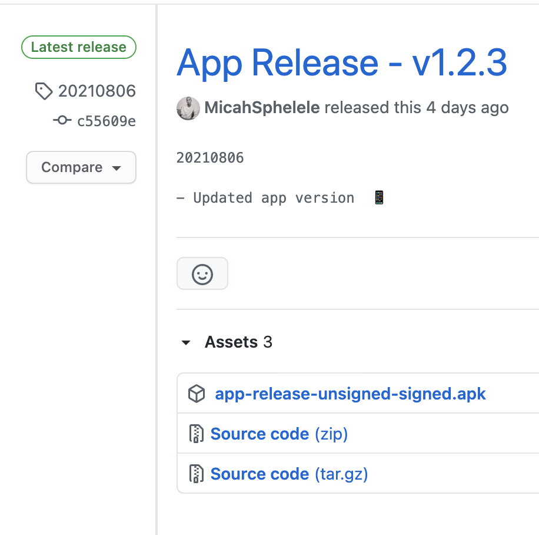

# action-publish-signed-apk 📦


Github action to publish signed android APK file 

## How to consume
To consume this action you simply need to the following code to your `.github/workflows/android.yml` 

#### YML

```
name: Publish release APK

# Controls when the action will run.
on:
  # Triggers the workflow on push or pull request events but only for the master branch
  push:
    tags:
      - '*'

  # Allows you to run this workflow manually from the Actions tab
  workflow_dispatch:

jobs:
  package-release-apk:
    name: Generate release APK
    runs-on: ubuntu-latest
    steps:
      - name: Checkout code for app release
        uses: actions/checkout@v2

      - name: Set up JDK 1.8
        uses: actions/setup-java@v1
        with:
          java-version: 1.8

      - name: Generate signed APK
        run: ./gradlew assembleRelease --stacktrace

      - name: Sign APK with keystore
        uses: r0adkll/sign-android-release@v1
        id: sign_app
        with:
          releaseDirectory: app/build/outputs/apk/release
          signingKeyBase64: ${{ secrets.KEY_STORE }}
          alias: ${{ secrets.KEY_STORE_ALIAS }}
          keyStorePassword: ${{ secrets.KEY_STORE_PASS }}
          keyPassword: ${{ secrets.KEY_STORE_PASS }}
        env:
          BUILD_TOOLS_VERSION: "30.0.2"

      - name: Upload release APK
        uses: actions/upload-artifact@v2
        with:
          name: app-release.apk
          path: ${{steps.sign_app.outputs.signedReleaseFile}}

      - name: Echo APK
        run: echo Signed APK FILE ${{steps.sign_app.outputs.signedReleaseFile}}

      - name: Release signed APK
        uses: MicahSphelele/action-publish-signed-apk@main
        env:
          GITHUB_TOKEN: ${{ secrets.TOKEN }}
          APP_FOLDER: app
          FILE_DIR: ${{steps.sign_app.outputs.signedReleaseFile}}
```
### Secret

You will have to provide this secret token to use the action. You can enter your secret in your repository Settings > Secrets

* **TOKEN**: Create a new [access token](https://github.com/settings/tokens) with `repo` access.

One thing to note using the default `GITHUB_TOKEN` provided universally will fail to authorize the user.

### Environment Variables

You'll need to provide these environment variables to specify exactly what information is needed to build the APK. 

* **APP_FOLDER**: main folder to search for the gradle that will get the app version name. Most of the time, it's `app`

* **FILE_DIR** this the directory of the apk file `app/build/outputs/apk/release/*-release.apk`

## Thanks to 🙌🏾
[ShaunLWM/action-release-debugapk](https://github.com/ShaunLWM/action-release-debugapk)
* 
